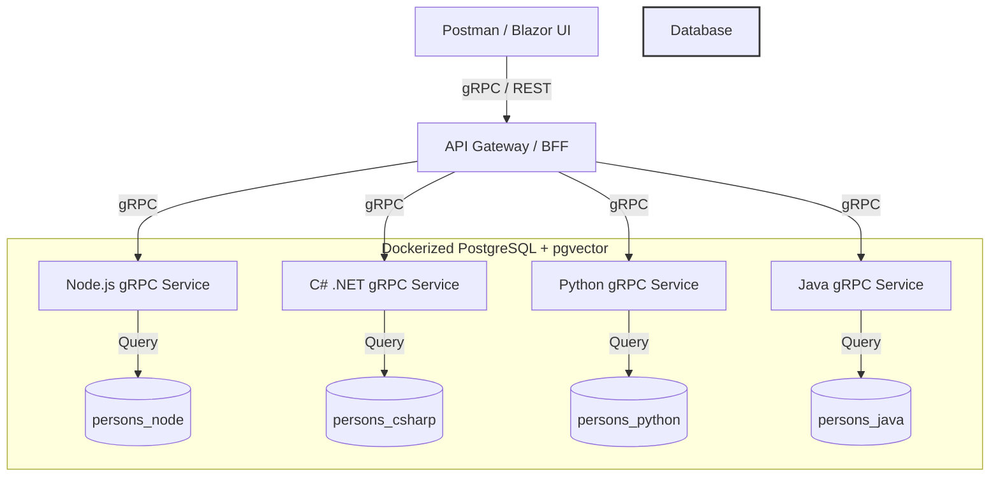

# OmniTest-Polyglot-Nexus (OPN)

An enterprise-grade, monorepo architecture demonstrating polyglot microservice orchestration, AI Agent integration (OpenClaw/Hermes), and Retrieval-Augmented Generation (RAG) benchmarking. Built strictly on Clean Code and SOLID principles.

## 🏗 Architecture Overview

OPN utilizes a **database-per-language** isolation strategy backed by PostgreSQL and `pgvector`. Microservices communicate synchronously via **gRPC**, providing a highly performant and type-safe contract across the ecosystem. 

### System Flow

----------------------------

## 📂 Project Structure

```text
OmniTest-Polyglot-Nexus/
├── api-node/                 # Node.js (ESM, TypeScript) gRPC Microservice
│   ├── src/
│   │   ├── domain/           # Entities and Interfaces (DIP/SRP)
│   │   ├── infrastructure/   # Postgres/pgvector Implementation (LSP)
│   │   └── presentation/     # gRPC Controllers
├── api-csharp/               # ASP.NET Core gRPC Microservice (WIP)
├── api-python/               # Python gRPC Microservice (WIP)
├── api-java/                 # Java gRPC Microservice (WIP)
├── shared/                   # Shared Protobuf definitions (.proto)
├── infrastructure/           # Docker Compose, Init SQL Scripts
├── docs/                     # Postman Collections, Architecture logs
├── .gitignore
├── LICENSE
└── README.md
```

---

## 🚀 Key Technologies
*   **Languages:** C# (ASP.NET Core), TypeScript/Node.js (ESM), Python, Java, C++
*   **Database:** PostgreSQL with `pgvector` for semantic search / RAG.
*   **Communication:** gRPC / Protocol Buffers.
*   **Infrastructure:** Docker, Linux (Debian/Arch compatible bash scripts).
*   **QA / QC:** Extensively testable via Postman gRPC, built for eventual Playwright/k6 orchestration.

## 🧠 Design Principles Enforced
*   **SOLID:** Interface segregation in Repositories, Dependency Inversion via Composition Roots.
*   **Clean Architecture:** Strict separation between Presentation (gRPC), Infrastructure (Postgres), and Domain.
*   **Performance:** Isolated schema mapping ensuring no cross-service database locks during benchmark testing.


