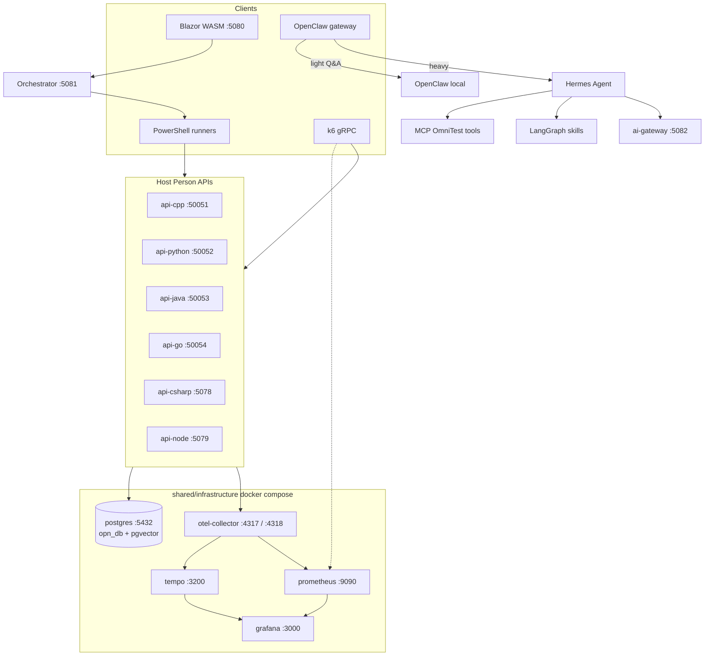

# OmniTest-Polyglot-Nexus (OPN)

Polyglot **Person** gRPC showcase: six languages, **one** PostgreSQL database (`opn_db`), **one table per language**, Clean Architecture / SOLID, QA history, Grafana, and an OpenClaw + Hermes Agent hybrid.

Isolation is **table-per-language**, not database-per-language.

## Architecture (matches Docker Compose)


```mermaid
flowchart TB
  subgraph clients [Clients]
    Blazor["Blazor WASM :5080"]
    PS[PowerShell runners]
    K6[k6 gRPC]
    OC[OpenClaw gateway]
  end

  Orch["Orchestrator :5081"]
  Blazor --> Orch
  Orch --> PS

  subgraph apis [Host Person APIs]
    CPP["api-cpp :50051"]
    PY["api-python :50052"]
    JV["api-java :50053"]
    GO["api-go :50054"]
    CS["api-csharp :5078"]
    ND["api-node :5079"]
  end

  PS --> apis
  K6 --> apis

  subgraph compose [shared/infrastructure docker compose]
    PG[("postgres :5432\nopn_db + pgvector")]
    OTEL["otel-collector :4317 / :4318"]
    PROM["prometheus :9090"]
    TEMPO["tempo :3200"]
    GRAF["grafana :3000"]
    OTEL --> TEMPO
    OTEL --> PROM
    PROM --> GRAF
    TEMPO --> GRAF
  end

  apis --> PG
  apis --> OTEL
  K6 -.-> PROM

  OC -->|light Q&A| Local[OpenClaw local]
  OC -->|heavy| Hermes[Hermes Agent]
  Hermes --> MCP[MCP OmniTest tools]
  Hermes --> LG[LangGraph skills]
  Hermes --> AIGW["ai-gateway :5082"]
```

## Tree

```text
OmniTest-Polyglot-Nexus/
├── MASTER_IMPLEMENTATION_PROMPT.md
├── README.md
├── apps/
│   ├── blazor-ui/                         # WASM :5080
│   └── benchmark-runner/
│       ├── config/services.json
│       ├── powershell/                    # Windows-first runners
│       ├── k6/
│       ├── orchestrator/                  # FastAPI :5081
│       └── reports/history|bugs|managerial
├── services/
│   ├── api-cpp/         :50051  persons_cpp
│   ├── api-python/      :50052  persons_python
│   ├── api-java/        :50053  persons_java
│   ├── api-go/          :50054  persons_golang
│   ├── api-csharp/      :5078   persons_csharp
│   ├── api-node/        :5079   persons_node
│   ├── ai-gateway/      :5082   /rag/query /agent/run
│   └── ai-agents/       OpenClaw + Hermes + MCP + LangGraph
├── shared/
│   ├── proto/person_service.proto
│   └── infrastructure/  compose + otel + prometheus + grafana + tempo
├── data/
│   ├── master_seed.csv
│   ├── mock-generator/
│   ├── vector-store/
│   └── knowledge-base/
└── docs/gherkin/
```

## Language table and ports

| Language | Folder | gRPC port | Table | Start (from that folder) |
|----------|--------|-----------|--------|--------------------------|
| C++ | `services/api-cpp` | 50051 | `persons_cpp` | CMake build, then `api_cpp` — see service README |
| Python | `services/api-python` | 50052 | `persons_python` | `pip install -r requirements.txt` then `python main.py` |
| Java | `services/api-java` | 50053 | `persons_java` | `.\mvnw.cmd spring-boot:run` |
| Go | `services/api-go` | 50054 | `persons_golang` | `go run ./cmd/server` |
| C# | `services/api-csharp` | 5078 | `persons_csharp` | `dotnet run` |
| Node | `services/api-node` | 5079 | `persons_node` | `npm install` then `npm start` |

Contract: `CreatePerson`, `ReadAllPersons`, `SearchByFilter`, `SearchByVector`. Proto is `shared/proto/person_service.proto` (package `omnitest.polyglot.nexus`). Each API queries **only** its own table.

Other ports: Blazor **5080**, orchestrator **5081**, ai-gateway **5082**, Grafana **3000**, Prometheus **9090**, Tempo **3200**, OTLP **4317/4318**, Postgres **5432**.

## Start Compose (Postgres + observability)

```powershell
cd shared\infrastructure
docker compose up -d
docker compose ps
```

- Grafana: [http://localhost:3000](http://localhost:3000) — anonymous Admin or `admin` / `admin`
- During live APIs: dashboard **gRPC RED — six languages**
- During k6 remote-write: **Test-run comparison — p90 / p95 / p98**

Set `OTEL_EXPORTER_OTLP_ENDPOINT=localhost:4317` on APIs when you want traces/metrics. Details: `shared/infrastructure/README.md`.

Existing `pg_data` volumes do **not** re-run init SQL. Use `data/vector-store/migrations/` instead of wiping embeddings.

## Tests (Windows PowerShell)

```powershell
cd apps\benchmark-runner\powershell
.\Invoke-ManualTest.ps1 -TestId TC-FUNC-001 -Language python
.\Invoke-AllManualTests.ps1
.\New-ManagerialReport.ps1
```

Functional coverage is **loops** (4 RPCs × 6 languages) in `Invoke-FunctionalRpc.ps1`. Thin cases live under `powershell/manual/`. If **grpcurl** is missing, the runner records a fail and does not send an RPC (mock-safe skip).

k6 scripts are in `apps/benchmark-runner/k6/` (`load.js`, `stress.js`, `spike.js`, `concurrency.js`, `security.js`). They are **not** claimed to have been executed by this repo snapshot. After you install k6:

```powershell
cd apps\benchmark-runner\k6
k6 run -e LANG=go .\load.js
```

BDD map: `docs/README.md` ↔ `docs/gherkin/*.feature` (`@functional` `@performance` `@security`).

History (append-only): `apps/benchmark-runner/reports/history/*.csv` + `*.jsonl`. Bugs: `reports/bugs/TEMPLATE.md`.

## Blazor + orchestrator

```powershell
cd apps\benchmark-runner\orchestrator
pip install -r requirements.txt
python main.py
```

```powershell
cd apps\blazor-ui
dotnet run
```

Open [http://localhost:5080](http://localhost:5080). Pages: Home (status), Probe, Tests, Compare, Grafana link.

## Agent hybrid

Users talk to **OpenClaw** (gateway). Heavy QA goes to **Hermes Agent**. MCP tools + LangGraph live under `services/ai-agents/`. RAG HTTP: `services/ai-gateway`. Install notes: `services/ai-agents/README.md`. Knowledge: `data/knowledge-base/`.

## Design rules

Presentation never talks SQL. Repositories never import proto. Composition root is `main` / `Program` / `index` only.
