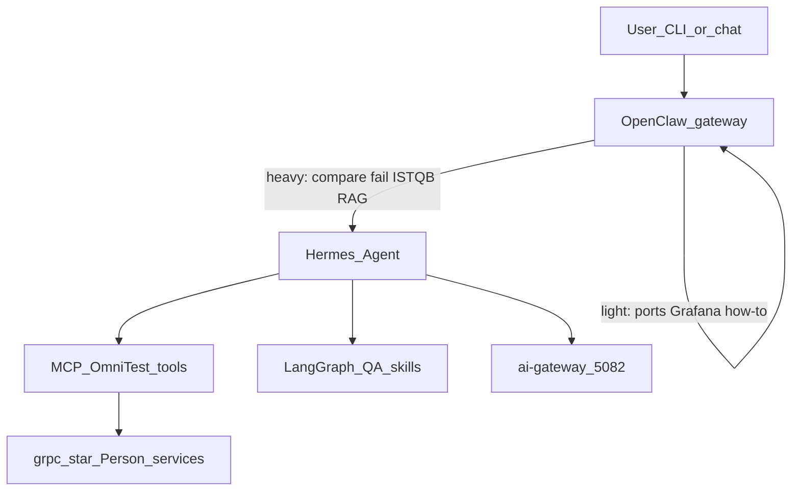

# services

Person **gRPC** implementations live in `grpc-*` folders (one language each). Each process talks only to its own `persons_*` table in `opn_db`.

`ai-gateway` and `ai-agents` are **not** Person servers. They are the RAG and agent layer: **OpenClaw** (user entry) plus **[Hermes Agent](https://hermes-agent.nousresearch.com/)** (heavy QA, memory, sandbox, subagents).

## How Hermes is used

| Role | Who |
|------|-----|
| Only public chat entry, short session | **OpenClaw** |
| Long-term memory, sandbox, subagents, skills | **Hermes Agent** (Nous Research) |
| Tools: list services, run tests, read reports, read-only SQL | MCP under [ai-agents/mcp](ai-agents/mcp/) |
| Repeatable graphs: compare, explain fail, draft ISTQB bug, RAG ask | LangGraph as **Hermes skills**, not a second chatbot |
| HTTP RAG `/rag/query` `/agent/run` | [ai-gateway](ai-gateway/) |

Install, light vs heavy routing, and env vars: **[ai-agents/README.md](ai-agents/README.md)**. Hermes skills notes: [ai-agents/hermes/](ai-agents/hermes/). OpenClaw config example: [ai-agents/openclaw/](ai-agents/openclaw/).

Do not treat Hermes as “just an LLM.” Do not expose a second competing chat UI that talks to Hermes while OpenClaw is the gateway.

## Folder map

| Folder | Port | Table / role |
|--------|------|----------------|
| `grpc-cpp` | 50051 | `persons_cpp` |
| `grpc-python` | 50052 | `persons_python` |
| `grpc-java` | 50053 | `persons_java` |
| `grpc-go` | 50054 | `persons_golang` |
| `grpc-csharp` | 5078 | `persons_csharp` |
| `grpc-node` | 5079 | `persons_node` |
| `ai-gateway` | 5082 | RAG HTTP; callable by Hermes |
| `ai-agents` | — | OpenClaw gateway + Hermes worker + MCP + LangGraph |

Each `grpc-*` service uses the same layers: `domain` (entities + repository interface) → `infrastructure` (Postgres) → `presentation` (gRPC mapping). Composition root is `main` / `Program` / `index` only.
